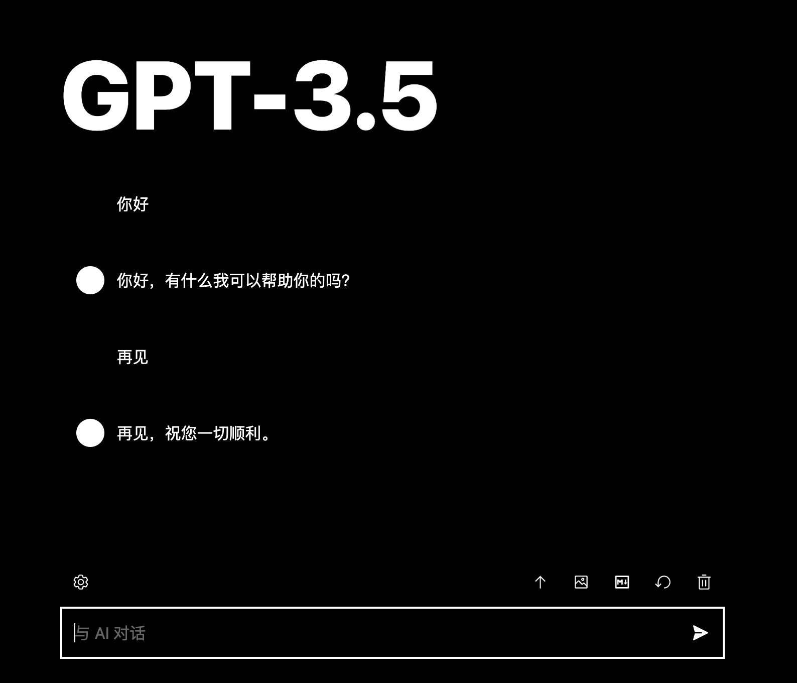
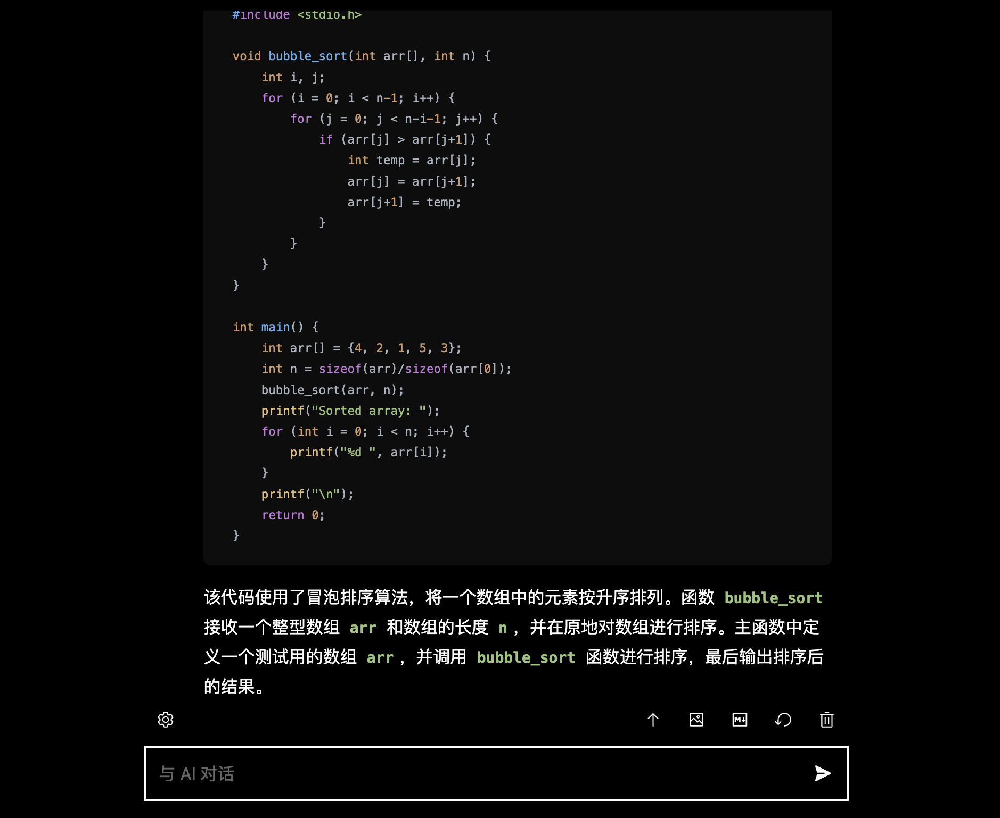

# ChatGPT-Dark




> 本项目基于 [chatgpt-vercel](https://github.com/ourongxing/chatgpt-vercel) 开发。


在本地开发和调试:

1. 升级到 `node18` (我的版本是v18.15.0)
2. 配置好环境变量 SOCKS_PROXY 需要通过代理访问API 默认值是 `socks5://127.0.0.1:1080`
3. `pnpm i` 安装依赖。
4. `pnpm dev` 启动调试。
5. `pnpm run build && node server.js` 打包和运行

### 环境变量

| 环境变量                           | 说明                                                         | 默认值                                                       |
| ---------------------------------- | ------------------------------------------------------------ | ------------------------------------------------------------ |
| `OPENAI_API_KEY`                   | OpenAI API Key，可以填写多个，用 `|` 或者 `换行` 隔开，随机调用。最好是多填几个，API 有并发上的限制。如果用户不填自己的 key，那么就会使用你的 key。 | 无                                                           |
| `DEFAULT_MESSAGE`                  | 默认提示信息                                                 | - 由 [OpenAI API](https://platform.openai.com/docs/guides/chat) 提供支持。<br/>- 由 [@CODEisArt](https://github.com/CODEisArrrt) 基于 [chatgpt-vercel](https://github.com/ourongxing/chatgpt-vercel) 开发，查看 [源码](https://github.com/CODEisArrrt/chatgpt-dark)，欢迎自部署。<br/>- [[Shift]] + [[Enter]] 换行，开头输入 [[/]] 或者 [[空格]] 搜索 Prompt 预设，点击输入框滚动到底部。 <br/>- 为了节省token消耗，默认不开启连续对话功能。<br/>- 当前没有给网站设置密码，请勿滥用。|
| `DEFAULT_SETTING`                  | 默认设置                                                     | {<br/>  "continuousDialogue": true,<br/>  "archiveSession": false,<br/>  "openaiAPIKey": "",<br />  "openaiAPITemperature": 60,<br/>  "systemRule": ""<br/>  "password": ""<br />} |
| `RESET_CONTINUOUS_DIALOGUE_OPTION` | 刷新时重置 `开启连续对话` 选项，在分享给很多人用的时候可以有效避免大量消耗。 | false                                                        |
| `OPENAI_API_BASE_URL`              | 本地开发时可以填写 OpenAI 的代理服务器，但是 Vercel 不需要。 | api.openai.com                                               |
| `PASSWORD`                         | 网站密码                                                     | 无                                                           |
| `MAX_INPUT_TOKENS`                 | 输入的 token 最大值，如果开启 `连续对话`，将计算之前的所有对话内容。OpenAI 限制 token 最大值为 4096，但这是输入和输出之和，所以可以将这个值设置为 3072， 留 1024 作为输出。如果不想被滥用，可以将这个值设置的再小一点。 | 3072                                                         |

将 `.env.example` 文件修改为 `.env`，在 `.env` 中设置。


### 默认设置

> 记得删除注释，或者直接复制上面表格里的。

```json5
{
  "continuousDialogue": true, // 开启连续对话，每次都需要将上下文传给 API，比较费钱，而且同样有 4096 token 的限制
  "archiveSession": false, // 记录对话内容，刷新后不会清空对话
  "openaiAPIKey": "", // 默认填写的 key，不需要填写，否则其他人看得到。
  "password": "",// 默认填写的密码，不需要填写，否则其他人看得到。
  "openaiAPITemperature": 60, // 0-100 越高 ChatGPT 思维就越发散，开始乱答
  "systemRule": "" // 系统角色指令，会在每次提问时添加。主要用于对 ChatGPT 的语气，口头禅这些进行定制。
}
```

## 提交你的 Prompts

1. Fork 本项目。
2. 修改 `prompts.md`。
3. Pull Request 即可。

如果你不懂这个操作，也可以直接在 Issues 提交你的 Prompts。目前大部分 Prompts 来自于 [awesome-chatgpt-prompts-zh](https://github.com/PlexPt/awesome-chatgpt-prompts-zh)，当然，这个仓库大多数也是翻译的 [awesome-chatgpt-prompts](https://github.com/f/awesome-chatgpt-prompts)，一并感谢。

### 要求

- 把需要输入的内容放在最后，可以提示 ChatGPT 开始输入了，比如 “我的第一句话是：”。
- 尽可能去优化已有的 Prompts，而不是重复添加。
- 添加到结尾，我会定期整理。


## License

[MIT](./LICENSE)
